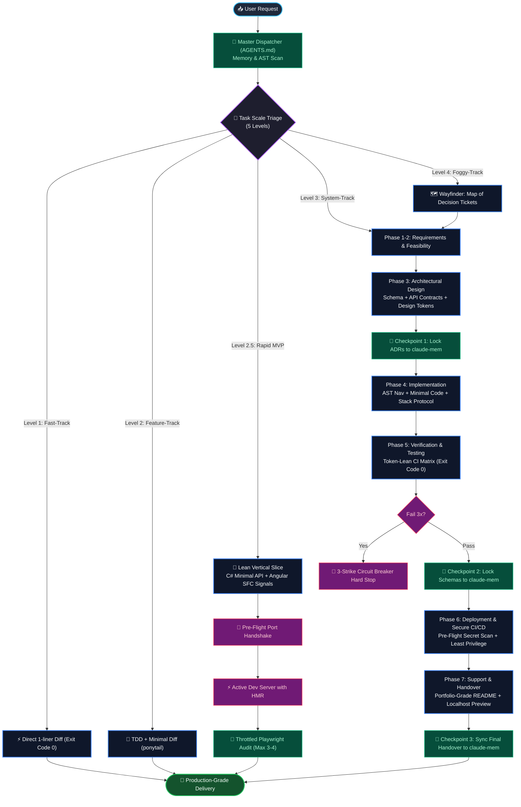

# 🏗️ Waterfall SDLC & Autonomous Engineering Suite

<div align="center">

[](https://zillerdx.github.io/waterfall-sdlc-skill/)
<br><br>

[](https://github.com/ZillerDX/waterfall-sdlc-skill/actions)
[](https://github.com/ZillerDX/waterfall-sdlc-skill)
[](https://github.com/ZillerDX/waterfall-sdlc-skill/releases)
[](https://opensource.org/licenses/MIT)
<br>
[](https://antigravity.google)
[](https://anthropic.com)
[](https://cursor.com)
[](https://github.com/features/copilot)

<p align="center">
  <b>Production-Grade Quality Gates, High-IQ Token Economy, Studio Frontend Design, and Zero-Leak Security for Autonomous AI Coding Agents.</b>
</p>

</div>

---

> 🌐 **Interactive Web Showcase & Simulator**: **[https://zillerdx.github.io/waterfall-sdlc-skill/](https://zillerdx.github.io/waterfall-sdlc-skill/)**  
> Test drive the live 7-phase animated lifecycle, interactive terminal simulator, and copyable prompt templates directly in your browser.

---

## 🎯 1. Who (Target Audience)

This suite is engineered specifically for:
- **AI Systems Engineers & Autonomous Agent Operators**: Developers using Google Antigravity, Claude Code, Cursor, or OpenAI Codex who need disciplined agent execution without runaway token loops.
- **Full-Stack Engineers & Tech Leads**: Teams building with C# .NET, Angular, React, TypeScript, or Python requiring strict architecture contracts, zero entity drift, and test-verified code.
- **Engineering Managers**: Leaders demanding tangible proof of software craftsmanship: verified test exit codes, zero leaked secrets, least-privilege CI/CD, and portfolio-caliber documentation.

---

## 🛑 2. Problem (The 4 Failure Modes of AI Coding)

When developers instruct unconstrained AI coding assistants to *"build an application"*, standard AI behavior degrades into 4 critical failure modes:

1. ❌ **Premature Coding & Scope Drift**: AI jumps directly into writing application code, inventing database schemas and API endpoints on the fly without signed-off requirements or architecture blueprints.
2. ❌ **Runaway Token Burn**: Running full verbose builds (e.g., raw `dotnet build`, `npm run build` loops) that dump thousands of lines of terminal noise into context, burning **40M–60M cumulative tokens** in recursive retry loops.
3. ❌ **Port Collisions & Zombie Processes**: Dev servers colliding on ports (`4200`, `5000`, `5080`), triggering 300+ step death spirals where the agent searches the entire filesystem to inspect processes.
4. ❌ **UI Slop & Missing Defensive UX**: Broken layouts, emojis as icons, unstyled controls, solitary spinners that trigger layout shifts (CLS), and hallucinated developer status badges in production UI.

---

## 💡 3. Solution (The Architectural Resolution)

**Waterfall SDLC & Autonomous Engineering Suite** transforms chaotic AI improvisations into a disciplined, enterprise-grade software delivery pipeline:

* **No Coding Before Design Sign-off**: Enforces an uncompromising rule where Phase 1 (Requirements), Phase 2 (Analysis), and Phase 3 (Design) must be sealed before any application code is created.
* **Master Dispatcher (`AGENTS.md`)**: A high-density operational matrix enforcing AST structural scanning, quiet build output filtering, mandatory dev-server HMR retention, and throttled visual verification.
* **Stack-Specific Lean Protocols**: .NET 9 Minimal APIs and Angular 19 Single-File Standalone Components with Signals, cutting boilerplate file sprawl by over 75%.
* **Studio Aesthetics + Matt Pocock Defensive UX**: Pure vector SVG icons, design tokens first, full skeleton screens, custom popover controls, and defensive text truncation.
* **Zero-Leak Secret Handling Protocol**: Safe ingestion of user API keys, isolated local-only configuration stores, pre-flight `.gitignore` verification, and strict backend proxy isolation.

---

## 🚀 4. Features (Core Capabilities)

* 🏗️ **7 Sequential SDLC Quality Gates**: Requirements ➔ Analysis ➔ Architecture Design ➔ Implementation ➔ Testing ➔ Deployment ➔ Handover.
* ⚡ **High-IQ Token Economy (Cuts 90–95% Token Burn)**: MSBuild error-only filtering (`-clp:ErrorsOnly`), AST structural scanning over file dumps, and sanitized non-interactive test runs.
* 🅰️ **Angular Modern (18/19+) Standards**: Single-File Standalone Components (SFC), native Angular Signals state architecture, non-interactive CLI flags (`$env:NG_CLI_ANALYTICS="false"`), and strict HMR dev server retention.
* ⚡ **C# .NET 9 Lean Tooling**: Minimal APIs in `Program.cs` for rapid MVPs/spikes, compact EF Core SQLite patterns, and automated Windows port hygiene.
* 🎨 **Studio-Grade Frontend Design**: High-contrast Cinematic vs high-density Instrument registers, zero layout shifts with skeletons, and ruthless anti-slop rules.
* 🔌 **Zero-Collision Port Handshake**: Automated 1-liner in PowerShell ensuring stale listeners are terminated before starting services, preventing port collision loops.
* 🛑 **3-Strike Circuit Breaker**: Mandatory hard stop, git stash checkpoint, and diagnostic escalation if any failure persists across 3 attempts.
* 🔒 **Zero-Leak Security Protocol**: Complete local storage isolation for API keys (`.env.local`, `appsettings.Local.json`) with zero client-side browser exposure.
* 🧠 **Event-Driven Memory Checkpoints**: Automatic synchronization of architecture contracts, ADRs, and verified schemas to `claude-mem` at key lifecycle events.

---

## 🛠️ 5. Tech Stack & Architectural Rationale

| Component | Technology | Architectural Rationale |
| :--- | :--- | :--- |
| **Autonomous Dispatcher** | `AGENTS.md` (Markdown System Matrix) | 120-line token-dense ruleset providing cross-model execution guardrails. |
| **SDLC Engine** | `waterfall-sdlc` (Quality Gate Machine) | Classical engineering discipline preventing premature coding and scope creep. |
| **Backend Standard** | C# .NET 9 Minimal APIs & EF Core | Token-lean single-file vertical slices eliminating 15-file controller sprawl. |
| **Frontend Standard** | Angular 19 Standalone + Signals | Atomic Single-File Components (`template: ...`) with sub-second HMR feedback. |
| **Design System** | `frontend-design` + Lucide SVGs | Matt Pocock defensive UI patterns, design tokens first, zero arbitrary values. |
| **Code Minimalism** | `ponytail` (YAGNI & Stdlib) | Native platform capabilities and standard libraries over dependency bloat. |
| **Live Docs Retrieval** | `context7` MCP | Real-time version-specific documentation eliminating API hallucinations. |
| **Memory Daemon** | `claude-mem` (Persistent AST Store) | Cross-session memory persistence with event-driven checkpointing. |
| **CI/CD Pipeline** | GitHub Actions (Ubuntu / Node 20) | Multi-job workflow with pre-flight secret leak scanning and least-privilege permissions. |

---

## 🏛️ 6. Architecture & System Flow



---

## ⚡ 7. Demo & One-Prompt Installation

### One-Prompt Autonomous Setup:
In **Google Antigravity**, **Claude Code**, **Cursor**, or **OpenAI Codex**, simply run:

```text
Install https://github.com/ZillerDX/waterfall-sdlc-skill and set up the master AGENTS.md workflow
```

*(or simply `Install https://github.com/ZillerDX/waterfall-sdlc-skill`)*

### What the Agent executes automatically:
1. Clones the suite into your agent's skills directory.
2. Registers the 4 bundled skills (`waterfall-sdlc`, `frontend-design`, `csharp-tooling`, `angular-modern`).
3. Deploys the master operational dispatcher (`AGENTS.md`) into your global system configuration.
4. Verifies companion tool integrations (`claude-mem`, `context7`, `ponytail`, `ast-grep`).

---

## 🖼️ 8. Visual Demonstration (Before vs. After Comparison)

| Dimension | Traditional Unconstrained AI Coding | Waterfall SDLC & Autonomous Suite |
| :--- | :--- | :--- |
| **Token Consumption** | **40M–60M tokens** per session in retry loops | **1M–3M tokens** (90–95% reduction) via filtered builds |
| **C# .NET Architecture** | 15+ files (Controllers, DTOs, Services, Repos) | **.NET 9 Minimal APIs** (1–2 files for MVPs/spikes) |
| **Angular Architecture** | 4 files per component (`.ts`, `.html`, `.css`, `.spec`) | **Single-File Standalone Components** with Signals |
| **UI Development Feedback**| `npm run build` loops (15–20s recompile each tweak) | **Active Dev Server with HMR** (sub-second updates) |
| **Port Conflicts** | 300+ steps searching filesystem for locked ports | **1-Liner Pre-Flight Port Handshake** (1 step) |
| **Visual Verification** | 130+ Playwright micro-action screenshots | **Throttled to 3–4 key milestone screenshots** |
| **Security & Secrets** | Hardcoded secrets or blind client-side exposure | **Zero-Leak Protocol** (Local storage + Backend proxy) |
| **Quality Deliverables** | Untested code and missing documentation | **100% Verified Tests, Secure CI/CD & Portfolio README** |

---

## 🔬 9. Engineering Evidence (Software Craftsmanship)

- **Automated CI/CD Pipeline**: Multi-job GitHub Actions workflow executing automated JSON validation, YAML frontmatter linting, and AGENTS.md integrity verification.
- **Pre-Flight Secret Scan**: Automated pattern scanning detecting and rejecting unmasked API keys (`sk_live_`, `ghp_`, `AQ.`, `AIzaSy`) before code can be merged.
- **Least-Privilege Security**: Workflow runs under strict `permissions: contents: read` enforcement.
- **Local Dev Server Hygiene**: Built-in PowerShell port clearing script:
  ```powershell
  Get-NetTCPConnection -LocalPort 4200,5000,5080 -ErrorAction SilentlyContinue | ForEach-Object { Stop-Process -Id $_.OwningProcess -Force }
  ```
- **Live Localhost Delivery**: Guarantees a clickable markdown link in every handover:
  `👉 Live Local Preview: http://localhost:4200`

---

## 📦 Bundled Skills Structure

```
waterfall-sdlc-skill/
├── AGENTS.md                          # 🧠 Master Autonomous Systems Dispatcher
├── plugin.json                        # 🔌 Antigravity / Agent Plugin Manifest
├── skills/
│   ├── waterfall-sdlc/
│   │   └── SKILL.md                   # 🏗️ 7-Phase SDLC Quality Gate Engine
│   ├── frontend-design/
│   │   └── SKILL.md                   # 🎨 Studio Aesthetics + Defensive UX Engine
│   ├── csharp-tooling/
│   │   └── SKILL.md                   # ⚡ C# .NET 9 Minimal APIs & Filtered MSBuild
│   └── angular-modern/
│       └── SKILL.md                   # 🅰️ Angular 19+ Single-File Components & Signals
├── .github/
│   └── workflows/
│       ├── validate-skills.yml        # ⚙️ Pre-Flight Secret Scan & CI Lint Pipeline
│       └── deploy-pages.yml           # 🚀 Automated GitHub Pages Showcase Deploy
└── index.html                         # 🌐 Live Interactive Web Simulator
```

---

## 📄 License & Community

Distributed under the **MIT License**. Created and maintained by [Tanathon Chanapha (ZillerDX)](https://github.com/ZillerDX). Contributions, issues, and feature proposals are welcome!
