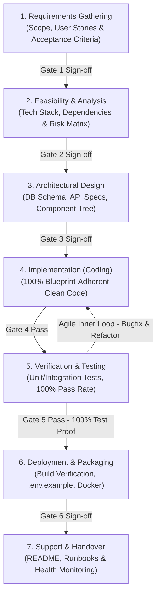

# Waterfall SDLC & Autonomous Engineering Suite 🏗️🎨🧠

<div align="center">

[](https://zillerdx.github.io/waterfall-sdlc-skill/)
<br>

[](https://github.com/ZillerDX/waterfall-sdlc-skill/releases)
[](https://opensource.org/licenses/MIT)
[](https://antigravity.google)
[](https://anthropic.com)
[](https://cursor.com)
[](https://github.com/features/copilot)
[](https://github.com/ZillerDX/waterfall-sdlc-skill/pulls)

</div>

> 🌐 **Interactive Web Showcase & Simulator**: **[https://zillerdx.github.io/waterfall-sdlc-skill/](https://zillerdx.github.io/waterfall-sdlc-skill/)**  
> Explore the live 7-phase animated lifecycle, interactive terminal simulator, and copyable prompt templates.

---

## ⚡ The Problem: AI "Premature Coding"

When developers ask an AI coding assistant to *"build an application"* or *"add a major feature"*, standard AI behavior is to jump straight into writing code:
- ❌ **No Scope Boundaries**: Hallucinating features, missing essential edge cases, or ballooning project scope.
- ❌ **Missing Architecture**: Improvising database schemas and API contracts on the fly, leading to painful refactors.
- ❌ **Zero Evidence**: Declaring "all tasks complete" without automated test proof or build verification.
- ❌ **UI Slop**: Inconsistent fonts, non-standard margins, emojis as icons, and unstyled form controls.

**Waterfall SDLC** enforces an uncompromising engineering standard: **"No Coding Before Design Sign-off."**

---

## ⚡ One-Prompt Autonomous Installation

When setting up a new machine or initializing a workspace in **Google Antigravity**, **Claude Code**, **Cursor**, or **OpenAI Codex**, you do not need to manually execute multiple terminal commands. Simply instruct your AI agent with a single prompt:

```text
Install https://github.com/ZillerDX/waterfall-sdlc-skill and set up the master AGENTS.md workflow
```

*(or simply `Install https://github.com/ZillerDX/waterfall-sdlc-skill`)*

### What the AI Agent will do automatically:
1. **Clone the Suite**: Clones this repository into the appropriate global plugin or skills directory (e.g. `~/.gemini/config/plugins/waterfall-sdlc` or `~/.claude/skills/`).
2. **Register Bundled Skills**: Automatically exposes both `waterfall-sdlc` and `frontend-design` to the agent runtime.
3. **Deploy `AGENTS.md`**: Places or links the master autonomous dispatcher into your global system instructions (`~/.gemini/config/AGENTS.md`) or project root.
4. **Companion Verification**: Inspects your environment and offers to link/configure companion skills (`ponytail`, `context7`, `claude-mem`, `ast-grep`, `superpowers`, etc.).

---

## 📦 Bundled Multi-Skill Suite Architecture

This repository is not just a single skill file—it is a production-grade **Autonomous AI Engineering Suite**:

```
waterfall-sdlc-skill/
├── AGENTS.md                          # 🧠 Master Autonomous Systems Dispatcher
├── plugin.json                        # 🔌 Antigravity / Agent Plugin Manifest
├── skills/
│   ├── waterfall-sdlc/
│   │   └── SKILL.md                   # 🏗️ 7-Phase SDLC Quality Gate Engine
│   └── frontend-design/
│       └── SKILL.md                   # 🎨 Studio Aesthetics + Defensive UX Engine
├── .github/
│   └── workflows/
│       ├── validate-skills.yml        # ⚙️ CI Lint for Skills & Manifests
│       └── deploy-pages.yml           # 🚀 Automated GitHub Pages Deployment
└── index.html                         # 🌐 Live Interactive Web Simulator
```

### 1. 🏗️ `waterfall-sdlc` (7-Phase SDLC Quality Gate)
Enforces a sequential, quality-gated engineering lifecycle:
- **Phase 1: Requirements Gathering** (Scope, personas, acceptance criteria)
- **Phase 2: Feasibility & Analysis** (Tech stack matrix, dependency risk audit)
- **Phase 3: Architectural Design** (DB Schema, OpenAPI contracts, UI hierarchy)
- **Phase 4: Implementation** (Blueprint-adherent, clean, strongly-typed code)
- **Phase 5: Verification & Testing** (Pre-flight port check, automated tests, 100% pass proof)
- **Phase 6: Deployment & Packaging** (Production build verification, zero-leak secrets)
- **Phase 7: Support & Handover** (Runbooks, documentation, **clickable localhost preview**)

### 2. 🎨 `frontend-design` (Studio Aesthetic + Matt Pocock Defensive UX)
Transforms sloppy AI interfaces into Linear/Stripe-caliber digital products:
- **Two Registers**: High-contrast Cinematic (marketing/landing) vs High-density Instrument (dashboards/apps).
- **Design Tokens First**: Strict token scales for color, type, and spacing. Zero arbitrary CSS values.
- **Matt Pocock Defensive Engineering**:
  - Full skeleton screens over solitary spinners (zero Cumulative Layout Shift).
  - Defensive text truncation (`truncate`, `line-clamp`) to prevent text overflowing bounds.
  - Custom popovers for selects and date inputs (banning unstyled native controls).
  - Single top-right close icon, backdrop click, and Escape key for modals (no redundant footer close buttons).
  - Numeric input empty-state coercion (`e.target.value === '' ? '' : Number(...)`).
  - Spatial separation of destructive actions to prevent accidental clicks.
- **Ruthless Anti-Slop Guard**: Vector SVG icons only (Lucide/Heroicons). Pure ban on emojis as icons.

### 3. 🧠 `AGENTS.md` (Master Autonomous Systems Dispatcher)
A 76-line high-density operational handbook coordinating autonomous agents:
- **High-IQ Token Economy**: AST and diagnostics (`smart_outline`, `ast-grep`, LSP) over raw file dumps. Dedicated exemption for full `SKILL.md` reads.
- **Layered Memory Funnel**: Seamless integration with `claude-mem` cross-session database.
- **5 Task Triage Levels**:
  - `Level 1 (Fast-Track)`: 1-line trivial bugfixes (no ceremonies).
  - `Level 2 (Feature-Track)`: Single component/endpoint with TDD.
  - `Level 2.5 (Rapid MVP)`: Vertical prototype with `ponytail` + `frontend-design`.
  - `Level 3 (System-Track)`: Full Waterfall SDLC 7-phase quality gate.
  - `Level 4 (Foggy-Track)`: Large open-ended refactors with decision ticket maps.
- **3-Strike Circuit Breaker**: Mandatory hard stop after 3 consecutive failures on the same root cause with concrete pragmatic recommendations.
- **Local-First & Windows PowerShell Safety**: Clean port inspection/killing commands and zero-leak API key handling.

---

## 🧭 The 7-Phase Quality Gate Lifecycle

Every phase requires a concrete, verifiable **Gate Deliverable** before the AI agent is permitted to advance to the next phase:



| Phase | Core Objective | Gate Deliverable |
| :--- | :--- | :--- |
| **1. Requirements** | Pin down functional/non-functional goals, personas, and boundaries | Requirements Specification + Acceptance Criteria |
| **2. Analysis** | Evaluate tech stack compatibility, dependencies, and architectural risks | Tech Stack Decision Matrix + Risk Mitigation Plan |
| **3. Design** | Produce complete technical blueprints before writing a single line of code | ERD / Database Schema + API Contracts + UI Hierarchy |
| **4. Implementation** | Translate the approved design into modular, clean, strongly-typed code | Complete codebase with zero syntax/type errors |
| **5. Testing** | Formally prove that the implementation satisfies all initial requirements | Pre-Flight Port Check + Automated Test Suite (Exit Code: 0) |
| **6. Deployment** | Package release artifacts for reproducible, error-free execution | Verified Production Build + Docker / Deployment Scripts |
| **7. Support** | Ensure long-term maintainability and operational clarity | Complete README + Runbook + **Clickable Localhost Preview** |

> [!NOTE]
> **Anti-Rigidity Guardrail (Agile Inner Loop 4 ⇄ 5)**:
> Waterfall SDLC must **never** become an inflexible bureaucracy.
> - **High-Speed Feedback Loop**: When tests fail or UI bugs emerge in Phase 5, the agent immediately fixes and refactors code directly in Phase 4 and re-tests in Phase 5.
> - **Escalation Threshold**: Only escalate back to Phase 1 or 3 if requirements change or architectural schemas must be modified.

> [!IMPORTANT]
> **Zero Port Collision & Instant Preview Guarantees**:
> 1. **Mandatory Pre-Launch Port Purge (Check & Kill First)**:
>    - **Windows (PowerShell)**: `Get-NetTCPConnection -LocalPort <port> -ErrorAction SilentlyContinue | ForEach-Object { Stop-Process -Id $_.OwningProcess -Force -ErrorAction SilentlyContinue }`
>    - **Linux / macOS (Bash)**: `fuser -k <port>/tcp 2>/dev/null || lsof -ti :<port> | xargs -r kill -9 2>/dev/null || true`
> 2. **Clickable Preview**: The agent *must* output a direct, clickable link in the chat: `👉 Live Local Preview: http://localhost:<port>`.

---

## 🚀 Manual Quickstart & Installation

If you prefer manual installation, use the copy-paste commands below:

### 1. Google Antigravity (Global Plugin)
Installs globally across all projects on your machine:
- **macOS / Linux / WSL**:
  ```bash
  git clone https://github.com/ZillerDX/waterfall-sdlc-skill.git ~/.gemini/config/plugins/waterfall-sdlc
  ```
- **Windows (PowerShell)**:
  ```powershell
  git clone https://github.com/ZillerDX/waterfall-sdlc-skill.git "$HOME\.gemini\config\plugins\waterfall-sdlc"
  ```

---

### 2. Per-Project / Universal Agents (`.agents`)
Installs inside a specific repository conforming to the `.agents/skills` standard:
- **macOS / Linux / WSL**:
  ```bash
  mkdir -p .agents/skills/waterfall-sdlc .agents/skills/frontend-design
  curl -sSL https://raw.githubusercontent.com/ZillerDX/waterfall-sdlc-skill/main/skills/waterfall-sdlc/SKILL.md -o .agents/skills/waterfall-sdlc/SKILL.md
  curl -sSL https://raw.githubusercontent.com/ZillerDX/waterfall-sdlc-skill/main/skills/frontend-design/SKILL.md -o .agents/skills/frontend-design/SKILL.md
  curl -sSL https://raw.githubusercontent.com/ZillerDX/waterfall-sdlc-skill/main/AGENTS.md -o AGENTS.md
  ```
- **Windows (PowerShell)**:
  ```powershell
  New-Item -ItemType Directory -Force -Path ".agents\skills\waterfall-sdlc", ".agents\skills\frontend-design" | Out-Null
  curl.exe -sSL https://raw.githubusercontent.com/ZillerDX/waterfall-sdlc-skill/main/skills/waterfall-sdlc/SKILL.md -o ".agents\skills\waterfall-sdlc\SKILL.md"
  curl.exe -sSL https://raw.githubusercontent.com/ZillerDX/waterfall-sdlc-skill/main/skills/frontend-design/SKILL.md -o ".agents\skills\frontend-design\SKILL.md"
  curl.exe -sSL https://raw.githubusercontent.com/ZillerDX/waterfall-sdlc-skill/main/AGENTS.md -o "AGENTS.md"
  ```

---

### 3. Claude Code (Anthropic)
Installs into Claude Code global skills:
- **macOS / Linux / WSL**:
  ```bash
  mkdir -p ~/.claude/skills/waterfall-sdlc ~/.claude/skills/frontend-design
  curl -sSL https://raw.githubusercontent.com/ZillerDX/waterfall-sdlc-skill/main/skills/waterfall-sdlc/SKILL.md -o ~/.claude/skills/waterfall-sdlc/SKILL.md
  curl -sSL https://raw.githubusercontent.com/ZillerDX/waterfall-sdlc-skill/main/skills/frontend-design/SKILL.md -o ~/.claude/skills/frontend-design/SKILL.md
  ```
- **Windows (PowerShell)**:
  ```powershell
  New-Item -ItemType Directory -Force -Path "$HOME\.claude\skills\waterfall-sdlc", "$HOME\.claude\skills\frontend-design" | Out-Null
  curl.exe -sSL https://raw.githubusercontent.com/ZillerDX/waterfall-sdlc-skill/main/skills/waterfall-sdlc/SKILL.md -o "$HOME\.claude\skills\waterfall-sdlc\SKILL.md"
  curl.exe -sSL https://raw.githubusercontent.com/ZillerDX/waterfall-sdlc-skill/main/skills/frontend-design/SKILL.md -o "$HOME\.claude\skills\frontend-design\SKILL.md"
  ```

---

### 4. Cursor (`.cursor/rules`)
Installs as project rules for Cursor IDE:
- **macOS / Linux / WSL**:
  ```bash
  mkdir -p .cursor/rules
  curl -sSL https://raw.githubusercontent.com/ZillerDX/waterfall-sdlc-skill/main/skills/waterfall-sdlc/SKILL.md -o .cursor/rules/waterfall-sdlc.mdc
  curl -sSL https://raw.githubusercontent.com/ZillerDX/waterfall-sdlc-skill/main/skills/frontend-design/SKILL.md -o .cursor/rules/frontend-design.mdc
  ```
- **Windows (PowerShell)**:
  ```powershell
  New-Item -ItemType Directory -Force -Path ".cursor\rules" | Out-Null
  curl.exe -sSL https://raw.githubusercontent.com/ZillerDX/waterfall-sdlc-skill/main/skills/waterfall-sdlc/SKILL.md -o ".cursor\rules\waterfall-sdlc.mdc"
  curl.exe -sSL https://raw.githubusercontent.com/ZillerDX/waterfall-sdlc-skill/main/skills/frontend-design/SKILL.md -o ".cursor\rules\frontend-design.mdc"
  ```

---

### 5. OpenAI Codex & GitHub Copilot (`.codex/skills`)
- **macOS / Linux / WSL**:
  ```bash
  mkdir -p .codex/skills/waterfall-sdlc .codex/skills/frontend-design
  curl -sSL https://raw.githubusercontent.com/ZillerDX/waterfall-sdlc-skill/main/skills/waterfall-sdlc/SKILL.md -o .codex/skills/waterfall-sdlc/SKILL.md
  curl -sSL https://raw.githubusercontent.com/ZillerDX/waterfall-sdlc-skill/main/skills/frontend-design/SKILL.md -o .codex/skills/frontend-design/SKILL.md
  ```
- **Windows (PowerShell)**:
  ```powershell
  New-Item -ItemType Directory -Force -Path ".codex\skills\waterfall-sdlc", ".codex\skills\frontend-design" | Out-Null
  curl.exe -sSL https://raw.githubusercontent.com/ZillerDX/waterfall-sdlc-skill/main/skills/waterfall-sdlc/SKILL.md -o ".codex\skills\waterfall-sdlc\SKILL.md"
  curl.exe -sSL https://raw.githubusercontent.com/ZillerDX/waterfall-sdlc-skill/main/skills/frontend-design/SKILL.md -o ".codex\skills\frontend-design\SKILL.md"
  ```

---

## 🔗 Companion Skills Directory (Recommended Workflow Ecosystem)

`AGENTS.md` coordinates specialized companion tools to form a complete autonomous software engineering lifecycle. Install these companion skills alongside Waterfall SDLC:

| Companion Skill / Tool | Role in `AGENTS.md` Workflow | Source Repository / Package |
| :--- | :--- | :--- |
| **`ponytail`** | **Code Minimalism & YAGNI**: Enforces simplest possible solutions, bans speculative abstractions, standard library over external dependencies. | [FootyBrain / Ponytail Suite](https://github.com/SkyShineTH/FootyBrain) |
| **`context7`** | **Live Docs / Zero Hallucinations**: Fetches version-specific official docs for modern libraries (Next.js 15, React 19, Tailwind v4, Supabase). | [@upstash/context7-mcp](https://github.com/upstash/context7) |
| **`claude-mem`** | **Persistent Cross-Session Memory**: AST indexing and layered observation funnel persisting decisions across conversations. | [thedotdash/claude-mem](https://github.com/thedotdash/claude-mem) |
| **`ast-grep`** | **Structural AST Code Search & Rewrite**: Fast multi-file semantic search and code transformations without token waste. | [ast-grep/ast-grep](https://github.com/ast-grep/ast-grep) |
| **`superpowers`** | **TDD & Systematic Debugging**: Enforces strict test-driven development loops, unit test generation, and hypothesis-driven debugging. | [obra/superpowers](https://github.com/obra/superpowers) |
| **`domain-modeling`** | **Zero Entity Drift**: Maintains strict naming consistency across Database, API, and UI in `CONTEXT.md`. | [FootyBrain / Domain Modeling](https://github.com/SkyShineTH/FootyBrain) |
| **`pr-review-toolkit`** | **Multi-Lens Code Review**: 6-pass specialized inspection (correctness, performance, silent failures, types, security, simplicity). | [FootyBrain / PR Toolkit](https://github.com/SkyShineTH/FootyBrain) |
| **`commit-commands`** | **Atomic Conventional Commits**: Professional git staging, semantic commit messages, and clean branch hygiene. | [FootyBrain / Commit Commands](https://github.com/SkyShineTH/FootyBrain) |
| **`playwright`** | **Headless Visual & Error Audit**: Automated browser verification across desktop (1280px), tablet (768px), and mobile (375px) with 0 console errors. | [microsoft/playwright](https://github.com/microsoft/playwright) |

---

## 💡 Practical Prompt Templates

### 🌟 1. Full-Stack Application from Scratch
```text
I want to build a "Personal Portfolio & Showcase" web application.
Please enforce the Waterfall SDLC and frontend-design skills strictly:
- Start with Phase 1: Requirements Gathering and define Acceptance Criteria.
- Proceed to Phase 2 & 3: Propose the Tech Stack (Next.js, Tailwind, Supabase) and produce the Database Schema + API Contract.
- STOP and present the Architectural Blueprint for my approval before writing any code.
```

### 🛠️ 2. Complex Backend Service / Microservice
```text
We need to design and build an authenticated Payment Webhook service with Stripe.
Apply Waterfall SDLC:
1. Specify all webhook event types and failure handling requirements.
2. Design the idempotent database schema and transaction state machine.
3. Once approved, implement with TDD (unit tests first) and verify exit code 0.
```

### 🎨 3. Enterprise Design System & Dashboard
```text
Create an Analytics Dashboard following Waterfall SDLC and frontend-design standards:
- Outline user journeys, metrics, and chart requirements first.
- Present layout tokens, typography hierarchy (tracking-tight), and vector iconography (Lucide only, no emojis).
- Build and verify locally on localhost before release.
```

---

## 📄 License

Distributed under the **MIT License**. See [LICENSE](LICENSE) for more information.

Developed with ❤️ by [Tanathon Chanapha (ZillerDX)](https://github.com/ZillerDX).