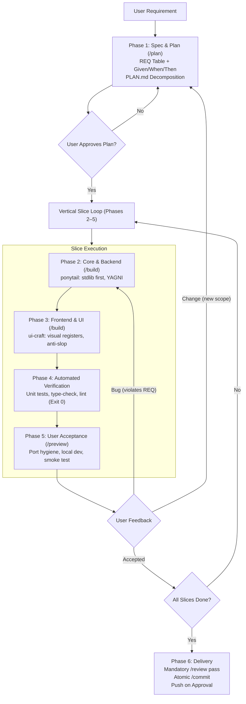

# ZillerDX SDLC & Autonomous Engineering Suite 2026

<div align="center">


<br><br>

[](https://zillerdx.github.io/zillerdx-sdlc-skill/)
<br><br>

[](https://github.com/ZillerDX/zillerdx-sdlc-skill/actions)
[](https://github.com/ZillerDX/zillerdx-sdlc-skill)
[](https://github.com/ZillerDX/zillerdx-sdlc-skill/releases)
[](https://opensource.org/licenses/MIT)
<br>
[](https://antigravity.google)
[](https://anthropic.com)
[](https://cursor.com)
[](https://codeium.com/windsurf)

<p align="center">
  <b>The Master Autonomous Systems Dispatcher: Spec-Driven 6-Phase Vertical Slice Loop, PLAN.md State Engine, Lazy Senior Developer Discipline (ponytail), Modular UI Craft, Multi-Lens Review, and Zero-Leak DevSecOps for AI Coding Agents.</b>
</p>

</div>

---

> **Interactive Web Showcase & Workspace Installer**: **[https://zillerdx.github.io/zillerdx-sdlc-skill/](https://zillerdx.github.io/zillerdx-sdlc-skill/)**  
> Explore the live interactive architecture visualizer, 1-click terminal installation tabs, and copyable prompt templates directly in your browser.

---

## 1. Target Audience

This suite is engineered specifically for:
- **Autonomous AI Agents & Systems Engineers**: AI agents operating in Google Antigravity, Claude Code, Cursor, or Windsurf that require deterministic workflows, strict state tracking, and zero token waste.
- **Full-Stack Engineers & Tech Leads**: Developers building production systems with TypeScript, Node.js, C# .NET 10 LTS, Python, or Dart who demand clean domain models, zero entity drift, and test-verified code.
- **QA Engineers & Delivery Leads**: Teams requiring complete traceability, standardized PR templates with reproducible test steps, automated pass criteria (Exit Code 0), and zero security leaks.

---

## 2. Problem: The 5 Failure Modes of AI Coding

When unconstrained AI coding models are asked to *"build an application"*, execution rapidly degrades into 5 chronic failure modes:

1. **Context Drift & State Loss**: After 5–10 tool calls or session restarts, the agent forgets where it left off, repeats already finished steps, or diverges from original constraints.
2. **Premature Whole-File Rewriting**: Jumping directly into dumping 800-line whole-file replacements for a 3-line change, introducing syntax errors and token exhaustion.
3. **Runaway Token Burn & Verbose Logs**: Dumping thousands of lines of raw build/test stdout into context, burning millions of tokens in recursive failure loops.
4. **Port Collisions & Zombie Processes**: Dev servers colliding on ports (`3000`, `5000`, `8080`), triggering death spirals where the agent searches the entire filesystem to inspect processes.
5. **UI Slop & Missing Defensive UX**: Broken responsive layouts, emojis as icons, unstyled controls, solitary spinners that trigger layout shifts (CLS), and hallucinated status badges.

---

## 3. Solution: The Architectural Resolution

**ZillerDX SDLC & Autonomous Engineering Suite 2026** provides the definitive operational blueprint to turn autonomous AI coding agents into Principal Systems Engineers:

### 1. The 6-Phase Vertical Slice Loop
Work is broken down into end-to-end verifiable increments rather than monolithic horizontal layers:
- **Phase 1 — Spec & Plan (`/plan`)**: Requirement triage → REQ table with Given/When/Then acceptance criteria → vertical slices in `PLAN.md`. Stop for user approval.
- **Phase 2 — Core & Backend (`/build`)**: `ponytail` standard library minimalism, domain invariants, parameterized data access.
- **Phase 3 — Frontend & UI (`/build`, `/design`)**: `ui-craft` visual direction registers (Cinematic vs. Instrument), typography, design tokens, anti-slop.
- **Phase 4 — Automated Verification**: Non-interactive gates (unit tests, type-check, lint, build — Exit Code 0), AI verified evidence recorded in Acceptance table.
- **Phase 5 — User Acceptance (`/preview`)**: Platform-aware port hygiene, local background dev server, smoke test, and user feedback triage (Bug vs. Change).
- **Phase 6 — Delivery**: Mandatory multi-lens `/review`, atomic Conventional Commits (`/commit`), remote push only after 100% REQ user acceptance.

### 2. PLAN.md Autonomous State Engine
Before writing code, the agent decomposes requirements into an executable, stateful `PLAN.md` matrix in the project root. Progress is tracked atomically (`[ ]` -> `[x]`), eliminating context drift, preventing duplicate tool calls, and enabling instant session re-hydration after restarts or context compaction.

### 3. High-IQ Token Economy
- **Surgical Diff over Whole-File Rewrite**: Target minimal anchor lines (3–15 lines).
- **Outline over Code Dumps**: Inspect symbol outlines or targeted line ranges for files >100 lines.
- **Search Exclusion**: Exclude build artifacts and dependencies (`node_modules`, `dist`, `bin`, `obj`, `.git`, cache dirs).
- **Non-Interactive Execution**: Always supply non-interactive flags (`--ci`, `-y`, `--no-interaction`, `--nologo`).
- **Clean Relative Links**: Use clean relative paths (`[PLAN.md](PLAN.md)`) without `./` prefix to guarantee reliable IDE tab navigation.

---

## 4. Visual Architecture Flow


```mermaid
flowchart TD
    Req["User Requirement"] --> P1["Phase 1: Spec & Plan (/plan)\nREQ Table + Given/When/Then\nPLAN.md Decomposition"]
    P1 --> Gate1{"User Approves Plan?"}
    Gate1 -- No --> P1
    Gate1 -- Yes --> Loop["Vertical Slice Loop (Phases 2–5)"]
    
    subgraph Slices ["Slice Execution"]
        P2["Phase 2: Core & Backend (/build)\nponytail: stdlib first, YAGNI"]
        P3["Phase 3: Frontend & UI (/build)\nui-craft: visual registers, anti-slop"]
        P4["Phase 4: Automated Verification\nUnit tests, type-check, lint (Exit 0)"]
        P5["Phase 5: User Acceptance (/preview)\nPort hygiene, local dev, smoke test"]
        
        P2 --> P3 --> P4 --> P5
    end

    Loop --> Slices
    P5 --> Feedback{"User Feedback"}
    Feedback -- "Bug (violates REQ)" --> P2
    Feedback -- "Change (new scope)" --> P1
    Feedback -- "Accepted" --> NextSlice{"All Slices Done?"}
    NextSlice -- No --> Loop
    NextSlice -- Yes --> P6["Phase 6: Delivery\nMandatory /review pass\nAtomic /commit\nPush on Approval"]
```

---

## 5. Core Production Skills Suite

| Skill | Category | Description | Primary Invariants |
| :--- | :--- | :--- | :--- |
| **`ponytail`** | Backend & Logic | Lazy Senior Developer | Standard library first, YAGNI, surgical 3–15 line diffs, zero premature abstractions. |
| **`ui-craft`** | Frontend & UI/UX | Modular Senior Designer | Dual registers (Cinematic / Instrument), typography hierarchy, design tokens, anti-slop, Thai font pairing. |
| **`pr-review-toolkit`** | Code Review | Multi-Lens Reviewer | Security first (secrets, IDOR, injection), silent failure hunter across TS/C#/Python/Dart, writes `REVIEW.md`. |
| **`commit-commands`** | Version Control | Safe Conventional Git | Atomic commits via `git apply --cached`, pre-commit secret scan, user acceptance gate before remote push. |
| **`domain-modeling`** | Architecture | Strategic DDD (Level 3) | Ubiquitous glossary in `CONTEXT.md`, single-point invariant enforcement, ADRs in `docs/adr/`. |
| **`wayfinder`** | Exploration | Foggy Migration (Level 4) | Charts massive legacy unknowns into Decision Tickets, time-boxed spikes, spike-to-spec before production code. |

---

## 6. Task Scale Triage Matrix

| Level | Scope | PLAN.md Engine | Verification & Gates | Skills & Workflows |
| :--- | :--- | :--- | :--- | :--- |
| **1 — Fast-Track** | 1–2 files, trivial bugfix, typos | Bypass (no PLAN.md) | Syntax / existing tests pass (Exit Code 0) | Direct edit; `/commit` if asked |
| **2 — Feature-Track** | Single endpoint or UI component | Lean PLAN.md (Phases 2–5) | Unit tests, build passes, 0 console errors | `ponytail`, `ui-craft`, `/plan`, `/build`, `/preview`, `/review`, `/commit` |
| **2.5 — Rapid MVP** | Standalone prototype, hackathon | Lean PLAN.md + 1-line assumptions | Working vertical slice, smoke check pass | `ponytail`, `ui-craft` + `/design`, `/plan`, `/build`, `/preview`, `/commit` |
| **3 — Enterprise** | Multi-tier platform, core refactor | Full PLAN.md + CONTEXT.md & ADRs | Tests ≥80%, type-check clean, secret scan | `domain-modeling`, `ponytail`, `ui-craft`, `/plan`, `/build`, `/preview`, `/review`, `/commit` |
| **4 — Foggy / Migration** | Undefined legacy migration | PLAN.md links wayfinder map | Decision Tickets, spike-to-spec | `wayfinder` via `/wayfinder` → `/to-spec` → `/to-tickets` |

---

## 7. Installation & Quick Start

### Google Antigravity & Gemini CLI
Clone the suite and mount the dispatcher:
```bash
git clone https://github.com/ZillerDX/zillerdx-sdlc-skill.git .agents-tmp && cp -r .agents-tmp/.agents . && cp .agents-tmp/AGENTS.md . && rm -rf .agents-tmp
```

### Claude Code
Install as a skill:
```bash
git clone https://github.com/ZillerDX/zillerdx-sdlc-skill.git ~/.claude/skills/zillerdx-sdlc-skill
```

### Cursor
Install `.cursorrules`:
```bash
git clone https://github.com/ZillerDX/zillerdx-sdlc-skill.git .agents-tmp && cp .agents-tmp/AGENTS.md .cursorrules && rm -rf .agents-tmp
```

### Windsurf
Install `.windsurfrules`:
```bash
git clone https://github.com/ZillerDX/zillerdx-sdlc-skill.git .agents-tmp && cp .agents-tmp/AGENTS.md .windsurfrules && rm -rf .agents-tmp
```

---

## 8. Verification & 3-Strike Circuit Breaker

1. **Objective Machine Verification**: Success is verified by machine feedback (Exit Code 0, clean build, 0 uncaught console errors), not simulated ceremonies.
2. **3-Strike Circuit Breaker**: If a build, test, or fix fails 3 consecutive times with the same root cause:
   - **Hard Stop**: Cease blind retries immediately.
   - **Checkpoint**: Make a WIP commit on a private feature branch (never `git stash`).
   - **Escalate with Options**: Root-cause summary; Option A — pragmatic/native workaround; Option B — requirement relaxation; concrete recommendation (`→ recommendation`).

---

## 9. License & Credits

- **Author**: Tanathon Chanapha ([ZillerDX](https://github.com/ZillerDX))
- **Repository**: [https://github.com/ZillerDX/zillerdx-sdlc-skill](https://github.com/ZillerDX/zillerdx-sdlc-skill)
- **License**: [MIT License](LICENSE)
