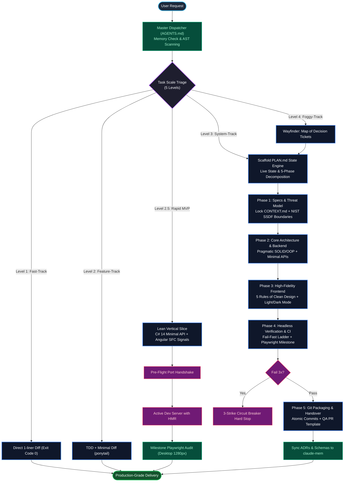

# Waterfall SDLC & Autonomous Engineering Suite 2.0

<div align="center">

[](https://zillerdx.github.io/waterfall-sdlc-skill/)
<br><br>

[](https://github.com/ZillerDX/waterfall-sdlc-skill/actions)
[](https://github.com/ZillerDX/waterfall-sdlc-skill)
[](https://github.com/ZillerDX/waterfall-sdlc-skill/releases)
[](https://opensource.org/licenses/MIT)
<br>
[](https://antigravity.google)
[](https://anthropic.com)
[](https://cursor.com)
[](https://codeium.com/windsurf)

<p align="center">
  <b>The Master Autonomous Systems Dispatcher: PLAN.md State Engine, Pragmatic SOLID/OOP, DevSecOps NIST SSDF, High-IQ Token Economy, and 12-Step QA-Centric CI/CD for AI Coding Agents.</b>
</p>

</div>

---

> **Interactive Web Showcase & Workspace Installer**: **[https://zillerdx.github.io/waterfall-sdlc-skill/](https://zillerdx.github.io/waterfall-sdlc-skill/)**  
> Explore the live interactive architecture visualizer, 1-click terminal installation tabs, and copyable prompt templates directly in your browser.

---

## 1. Who (Target Audience)

This suite is engineered specifically for:
- **Autonomous AI Agents & Systems Engineers**: AI agents operating in Google Antigravity, Claude Code, Cursor, or Windsurf that require deterministic workflows, strict state tracking, and zero token waste.
- **Full-Stack Engineers & Tech Leads**: Developers building production systems with C# .NET 10 LTS, Angular Standalone Signals, TypeScript, or Python who demand clean domain models, zero entity drift, and test-verified code.
- **QA Engineers & Delivery Leads**: Teams requiring complete traceability, standardized PR templates with reproducible test steps, automated unit/integration pass criteria (>=80% coverage), and zero security leaks.

---

## 2. Problem (The 5 Failure Modes of AI Coding)

When unconstrained AI coding models are asked to *"build an application"*, execution rapidly degrades into 5 chronic failure modes:

1. **Context Drift & State Loss**: After 5-10 tool calls or session restarts, the agent forgets where it left off, repeats already finished steps, or diverges from original constraints.
2. **Premature Coding & Scope Sprawl**: Jumping directly into code before locking domain models, inventing schema on the fly, and creating unmaintainable spaghetti architectures.
3. **Runaway Token Burn & Verbose Logs**: Dumping thousands of lines of raw build/test stdout into context, burning millions of tokens in recursive failure loops.
4. **Port Collisions & Zombie Processes**: Dev servers colliding on ports (`4200`, `5000`, `8080`), triggering 300+ step death spirals where the agent searches the entire filesystem to inspect processes.
5. **UI Slop & Missing Defensive UX**: Broken responsive layouts, emojis as icons, unstyled controls, solitary spinners that trigger layout shifts (CLS), and hallucinated developer status badges in production UI.

---

## 3. Solution (The Architectural Resolution)

**Waterfall SDLC & Autonomous Engineering Suite 2.0** provides the definitive operational blueprint to turn autonomous AI coding agents into Principal Systems Engineers:

* **PLAN.md Autonomous State Engine**: Before writing code, the agent decomposes requirements into an executable, stateful `PLAN.md` matrix in the project root. Progress is tracked atomically (`[ ]` -> `[x]`), eliminating context drift, preventing duplicate tool calls, and enabling instant session re-hydration after restarts or context compaction.
* **Pragmatic SOLID & Object-Oriented Architecture**: AI evaluates contextual appropriateness before scaffolding:
  - *Light/Micro Scope*: Bans speculative interfaces and boilerplate sprawl; uses flat functions and minimal endpoints.
  - *Domain Core*: Enforces Single Responsibility, Open/Closed, Liskov Substitution, focused Interface Segregation (1-3 methods), and Dependency Inversion. Strictly favors Composition over Inheritance and bans "Interface Soup".
* **DevSecOps & NIST SSDF (SP 800-218)**: Shift-Left security starts before creating code. Defines trust boundaries, enforces Least Privilege, isolated local secrets (`.env.local`), pre-flight `.gitignore` verification, and strict backend proxy isolation (zero client-side key exposure).
* **12-Step QA-Centric CI/CD Lifecycle**: Enforces fail-fast verification (Lint -> Unit [>=80%] -> Build -> Integration -> SAST/Security Scan -> Playwright milestone), atomic Conventional Commits, and standardized PR templates with reproducible test steps.
* **The 5 Rules of Clean Design**: Studio-grade visual discipline: (1) Prioritize visual hierarchy (1 primary CTA), (2) Limit colors (strict 3-tone palette), (3) Disciplined typography (12, 14, 18-20, 28-36px, tabular numbers), (4) Easy scanning (3-second law), and (5) Whitespace as structure (`gap-6`/`gap-8`). Light mode default with persisted dark mode toggle.
* **.NET 10 LTS & C# 14 Protocol**: Enforces Minimal APIs in `Program.cs`, field-backed properties (`field`), native OpenAPI 3.1, and token-lean MSBuild error filtering (`--nologo -clp:ErrorsOnly`).

---

## 4. Features (Core Capabilities)

* **PLAN.md Autonomous State Engine**: Stateful 5-phase decomposition tracking progress live, eliminating context loss and duplicate tool runs.
* **Pragmatic SOLID & OOP Triage**: Context-aware architecture preventing garbage abstractions, interface soup, and class hierarchy bloat.
* **DevSecOps NIST SSDF Framework**: Shift-Left threat modeling, automated SAST, secret leak prevention, and zero client-side credential exposure.
* **12-Step QA-Centric CI/CD Pipeline**: Fail-fast CI ladder, unit test coverage gates (>=80%), atomic Conventional Commits, and standardized QA PR templates.
* **The 5 Rules of Clean Design**: Crisp Light Mode default, accessible dark mode toggle, 3-zone sticky navbar, bento grid layout, and zero Unicode emojis on UI.
* **High-IQ Token Economy (Cuts 85–95% Token Burn)**: MSBuild error-only filtering (`-clp:ErrorsOnly`), AST structural scanning over file dumps, surgical diffing (`replace_file_content`), and sanitized non-interactive test runs.
* **C# .NET 10 LTS & C# 14 Lean Tooling**: Minimal APIs in `Program.cs`, C# 14 field-backed properties, native OpenAPI 3.1, and automated Windows port hygiene.
* **Angular Modern Standalone Standards**: Single-File Standalone Components (SFC), native Angular Signals state architecture, non-interactive CLI flags (`$env:NG_CLI_ANALYTICS="false"`), and strict HMR dev server retention.
* **Playwright Milestone Discipline**: UI-only, milestone-gated inspection (1280px desktop, console health verification with 0 uncaught errors, capped to 1 proof screenshot).
* **Zero-Collision Port Handshake**: Automated 1-liner in PowerShell ensuring stale listeners are terminated before starting services, preventing port collision death spirals.
* **3-Strike Circuit Breaker**: Mandatory hard stop, git stash checkpoint, and diagnostic escalation if any failure persists across 3 attempts.
* **Event-Driven Memory Checkpoints**: Automatic synchronization of architecture contracts, ADRs, and verified schemas to `claude-mem`.

---

## 5. Tech Stack & Architectural Rationale

| Component | Technology | Architectural Rationale |
| :--- | :--- | :--- |
| **Autonomous Dispatcher** | `AGENTS.md` (Markdown System Matrix) | High-density operational decision matrix providing cross-model execution guardrails. |
| **State Engine** | `PLAN.md` (Stateful Task Decomposer) | Eliminates context drift, tracks live progress atomically, and prevents tool duplication. |
| **Architectural Model** | Pragmatic SOLID & Clean OOP | Contextual appropriateness triage eliminating boilerplate while ensuring domain encapsulation. |
| **Security Framework** | NIST SSDF (SP 800-218) & OWASP Top 10 | Shift-Left security, zero-leak secret handling, and isolated backend proxies. |
| **QA & CI/CD Pipeline** | 12-Step Fail-Fast Ladder & GitHub Actions | Structured quality verification, >=80% unit test coverage, and QA-ready PR templates. |
| **Backend Standard** | C# .NET 10 LTS & C# 14 Minimal APIs | Native OpenAPI 3.1, field-backed properties (`field`), and token-lean vertical slices. |
| **Frontend Standard** | Angular Standalone + Signals | Single-File Standalone Components (`inlineTemplate`) with sub-second HMR feedback. |
| **Design System** | `frontend-design` (5 Rules of Clean Design) | High contrast, 3-tone color limit, disciplined typography, and defensive UX patterns. |
| **Code Minimalism** | `ponytail` (YAGNI & Stdlib) | Native platform capabilities and standard libraries over dependency bloat. |
| **Live Docs Retrieval** | `context7` MCP | Real-time version-specific documentation eliminating API hallucinations. |
| **Memory Daemon** | `claude-mem` (Persistent AST Store) | Cross-session memory persistence with event-driven checkpointing. |

---

## 6. Architecture & System Flow


```mermaid
flowchart TD
    classDef startNode fill:#1e293b,stroke:#38bdf8,stroke-width:2px,color:#f8fafc;
    classDef triageNode fill:#1e1e2e,stroke:#a855f7,stroke-width:2px,color:#f8fafc;
    classDef gateNode fill:#0f172a,stroke:#3b82f6,stroke-width:2px,color:#f8fafc;
    classDef skillNode fill:#064e3b,stroke:#10b981,stroke-width:1.5px,color:#a7f3d0;
    classDef guardNode fill:#701a75,stroke:#f43f5e,stroke-width:1.5px,color:#fecdd3;
    classDef endNode fill:#14532d,stroke:#22c55e,stroke-width:2px,color:#f0fdf4;

    Start(["User Request"]):::startNode --> Dispatcher["Master Dispatcher (AGENTS.md)<br>Memory Check & AST Scanning"]:::skillNode
    
    Dispatcher --> Triage{"Task Scale Triage<br>(5 Levels)"}:::triageNode

    Triage -- "Level 1: Fast-Track" --> L1["Direct 1-liner Diff (Exit Code 0)"]:::gateNode --> Complete
    Triage -- "Level 2: Feature-Track" --> L2["TDD + Minimal Diff (ponytail)"]:::gateNode --> Complete
    
    Triage -- "Level 2.5: Rapid MVP" --> MVP["Lean Vertical Slice<br>C# 14 Minimal API + Angular SFC Signals"]:::gateNode
    MVP --> PrePort["Pre-Flight Port Handshake"]:::guardNode
    PrePort --> HMR["Active Dev Server with HMR"]:::guardNode
    HMR --> MVP_Done["Milestone Playwright Audit (Desktop 1280px)"]:::skillNode --> Complete

    Triage -- "Level 3: System-Track" --> PlanInit["Scaffold PLAN.md State Engine<br>Live State & 5-Phase Decomposition"]:::gateNode
    
    PlanInit --> P1["Phase 1: Specs & Threat Model<br>Lock CONTEXT.md + NIST SSDF Boundaries"]:::gateNode
    P1 --> P2["Phase 2: Core Architecture & Backend<br>Pragmatic SOLID/OOP + Minimal APIs"]:::gateNode
    P2 --> P3["Phase 3: High-Fidelity Frontend<br>5 Rules of Clean Design + Light/Dark Mode"]:::gateNode
    P3 --> P4["Phase 4: Headless Verification & CI<br>Fail-Fast Ladder + Playwright Milestone"]:::gateNode
    
    P4 --> CB{"Fail 3x?"}:::guardNode
    CB -- Yes --> Stop["3-Strike Circuit Breaker Hard Stop"]:::guardNode
    CB -- Pass --> P5["Phase 5: Git Packaging & Handover<br>Atomic Commits + QA PR Template"]:::gateNode
    
    P5 --> CP["Sync ADRs & Schemas to claude-mem"]:::skillNode --> Complete

    Triage -- "Level 4: Foggy-Track" --> L4["Wayfinder: Map of Decision Tickets"]:::gateNode --> PlanInit

    Complete(["Production-Grade Delivery"]):::endNode
```

---

## 7. Demo & Multi-Client Installation

### 1-Prompt Autonomous Workspace Setup
In **Google Antigravity**, **Claude Code**, **Cursor**, or **Windsurf**, simply command your agent:

```text
Install https://github.com/ZillerDX/waterfall-sdlc-skill and apply the master AGENTS.md dispatcher
```

### Direct Terminal Installation by Client:

#### Google Antigravity / Gemini CLI
```powershell
git clone https://github.com/ZillerDX/waterfall-sdlc-skill.git $env:USERPROFILE\.gemini\antigravity\skills\waterfall-sdlc
```

#### Claude Code (Anthropic)
```bash
git clone https://github.com/ZillerDX/waterfall-sdlc-skill.git ~/.claude/skills/waterfall-sdlc
```

#### Cursor & Windsurf
```bash
git clone https://github.com/ZillerDX/waterfall-sdlc-skill.git .cursor/skills/waterfall-sdlc
```

---

## 8. Visual Demonstration (Before vs. After Comparison)

| Dimension | Traditional Unconstrained AI Coding | Waterfall SDLC & Autonomous Suite 2.0 |
| :--- | :--- | :--- |
| **Context Retention** | Severe context drift after 5–10 steps; repeats work | **PLAN.md State Engine**: Atomic tracking, instant re-hydration |
| **Architectural Discipline** | Over-engineered "interface soup" or unstructured spaghetti | **Pragmatic SOLID/OOP**: Contextual triage, composition over inheritance |
| **Token Consumption** | **40M–60M tokens** per session in retry loops | **1M–3M tokens** (85–95% reduction) via filtered builds and surgical diffs |
| **C# .NET Architecture** | 15+ files (Controllers, DTOs, Repos, Mappings) | **.NET 10 LTS & C# 14 Minimal APIs** (field-backed properties, OpenAPI 3.1) |
| **Angular Architecture** | 4 files per component (`.ts`, `.html`, `.css`, `.spec`) | **Single-File Standalone Components** with Signals |
| **UI Design System** | Inconsistent colors, emojis as icons, broken dark mode | **5 Rules of Clean Design**: 3-tone limit, crisp Light/Dark dual-theme |
| **Port Conflicts** | 300+ steps searching filesystem for locked ports | **Pre-Flight Port Handshake** (1-step PowerShell kill) |
| **E2E Visual Testing** | 130+ continuous Playwright screenshots burning tokens | **Milestone-Gated Playwright**: Desktop 1280px, 0 console errors, 1 proof image |
| **Security & DevSecOps** | Hardcoded secrets or client-side leaked API keys | **NIST SSDF (SP 800-218)**: Isolated local storage, strict backend proxy |
| **QA Handover** | "Here is your code", missing tests or reproducer | **12-Step QA CI/CD**: Verified test exit code 0, standard QA PR template |

---

## 9. Engineering Evidence (Software Craftsmanship)

- **12-Step QA-Centric CI/CD Pipeline**: Multi-job GitHub Actions workflow executing automated JSON validation, YAML frontmatter linting, and AGENTS.md integrity verification.
- **Pre-Flight Secret Scan**: Automated pattern scanning detecting and rejecting unmasked API keys (`sk_live_`, `ghp_`, `AQ.`, `AIzaSy`) before code can be merged.
- **Least-Privilege Security**: Workflow runs under strict `permissions: contents: read` enforcement.
- **Pre-Flight Port Handshake**: Automated Windows PowerShell hygiene script killing stale listeners before launching dev servers:
  ```powershell
  Get-NetTCPConnection -LocalPort 4200,5000,8080 -ErrorAction SilentlyContinue | ForEach-Object { Stop-Process -Id $_.OwningProcess -Force }
  ```
- **Standardized QA Pull Request Template**:
  ```markdown
  ## What / Why
  Summary of architectural changes + ticket reference.

  ## How to Test
  1. Exact reproducible steps for QA verification.
  2. Test credentials and local environment prerequisites.

  ## Acceptance Criteria
  - [ ] Automated tests pass (Exit Code 0, >=80% coverage).
  - [ ] DevSecOps scan clean (0 secret leaks, 0 high CVEs).
  - [ ] Visual UI verified (0 console errors, 5 Rules of Clean Design compliant).

  ## Impact / Risk
  Regression boundaries and migration prerequisites.

  ## Evidence
  Proof screenshot and build exit codes.
  ```

---

## 📦 Bundled Skills & Repository Structure

```
waterfall-sdlc-skill/
├── AGENTS.md                          # Master Autonomous Systems Dispatcher (v2.0)
├── PLAN.md                            # Stateful 5-Phase Task Matrix & Progress Engine
├── plugin.json                        # Antigravity / Agent Plugin Manifest (v2.0.0)
├── package.json                       # Node.js Package Manifest (v2.0.0)
├── skills/
│   ├── waterfall-sdlc/
│   │   └── SKILL.md                   # 7-Phase SDLC Quality Gate Engine
│   ├── frontend-design/
│   │   └── SKILL.md                   # 5 Rules of Clean Design + Defensive UX Engine
│   ├── csharp-tooling/
│   │   └── SKILL.md                   # .NET 10 LTS & C# 14 Minimal APIs & Filtered MSBuild
│   └── angular-modern/
│       └── SKILL.md                   # Angular Standalone SFC & Signals Engine
├── .github/
│   └── workflows/
│       ├── validate-skills.yml        # Pre-Flight Secret Scan & CI Lint Pipeline
│       └── deploy-pages.yml           # Automated GitHub Pages Deployment
└── index.html                         # Live Interactive Web Simulator & Workspace Installer
```

---

## 📄 License & Community

Distributed under the **MIT License**. Created and maintained by [Tanathon Chanapha (ZillerDX)](https://github.com/ZillerDX). Contributions, issues, and feature proposals are welcome!

